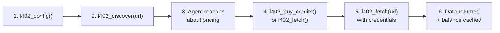

# 402-mcp

[](./LICENSE)
[](https://www.typescriptlang.org/)
[](https://nodejs.org/)
[](https://primal.net/p/npub1mgvlrnf5hm9yf0n5mf9nqmvarhvxkc6remu5ec3vf8r0txqkuk7su0e7q2)

L402 + x402 client MCP that gives AI agents economic agency. Discover, pay for, and consume any payment-gated API — no human registration, no API keys, no middlemen.

- **Discover** paid APIs on Nostr — no URLs needed upfront
- **Auto-pay** with Lightning (NWC), Cashu ecash, or human QR fallback
- **Credentials cached and encrypted** at rest (AES-256-GCM)
- **Works with any L402 server** — toll-booth, Aperture, or any future implementation

## Quick start

**1. Install**

```bash
npx 402-mcp
```

**2. Connect to Claude Code**

```bash
claude mcp add 402-mcp -- npx 402-mcp
```

**3. Try it**

Ask Claude: *"Search for paid joke APIs using l402_search"* — no wallet needed, just discovery.

Ready to make paid calls? See the [full quickstart guide](./docs/quickstart.md) to set up a wallet and watch your agent pay for its first API call.

## Configuration

| Variable | Default | Description |
|----------|---------|-------------|
| `NWC_URI` | - | Nostr Wallet Connect URI for autonomous Lightning payments |
| `CASHU_TOKENS` | - | Path to Cashu token store file |
| `MAX_AUTO_PAY_SATS` | 1000 | Safety cap; payments above this require human confirmation |
| `CREDENTIAL_STORE` | `~/.402-mcp/credentials.json` | Persistent macaroon/credential storage |
| `TRANSPORT` | `stdio` | Transport mode: `stdio` or `http` |
| `PORT` | 3402 | HTTP server port (when `TRANSPORT=http`) |

## Tools

### Core L402 (any server)

| Tool | Description |
|------|-------------|
| `l402_config` | Introspect payment capabilities (wallets, limits, credential count) |
| `l402_discover` | Probe an endpoint to discover pricing without paying |
| `l402_fetch` | HTTP request with L402 support; auto-pays if within budget |
| `l402_pay` | Pay a specific invoice (NWC, Cashu, or human-in-the-loop) |
| `l402_credentials` | List stored credentials and cached balances |
| `l402_balance` | Check cached credit balance for a server |
| `l402_search` | Discover L402 services on Nostr relays (kind 31402 announcements) |

### toll-booth extensions

| Tool | Description |
|------|-------------|
| `l402_buy_credits` | Browse and purchase volume discount tiers |
| `l402_redeem_cashu` | Redeem Cashu tokens directly (avoids Lightning round-trip) |

## How it works



**Example session:**

```
Agent: "I need routing data from routing.trotters.cc"

1. l402_config()
   -> nwcConfigured: true, maxAutoPaySats: 1000

2. l402_discover("https://routing.trotters.cc/api/route")
   -> 10 sats/request, toll-booth detected, tiers available

3. Agent reasons: "I need ~20 requests. The 500-sat tier
   gives 555 credits. Better value."

4. l402_buy_credits(url, amountSats=500)
   -> Paid 500 sats, received 555 credits

5. l402_fetch("https://routing.trotters.cc/api/route?from=...&to=...")
   -> 200 OK, route data, 545 credits remaining
```

For detailed architecture and payment flow diagrams, see [docs/architecture.md](./docs/architecture.md).

## Payment methods

Three payment rails, tried in priority order:

1. **NWC** (Nostr Wallet Connect) — fully autonomous; pays from your connected wallet
2. **Cashu** — fully autonomous; melts ecash tokens to pay invoices
3. **Human-in-the-loop** — presents QR code, polls for settlement

The agent can override the method per-call, or you can configure only the methods you want.

## Safety

`MAX_AUTO_PAY_SATS` caps any single autonomous payment. Above this limit, the agent must ask the human for approval. The agent can read this limit via `l402_config` and factor it into purchasing decisions.

## Privacy

402-mcp stores credentials locally on your machine only (`~/.402-mcp/credentials.json`, encrypted at rest). No data is sent to any third party. No accounts, no tracking, no analytics. Payments use Lightning or Cashu — pseudonymous by design.

## Ecosystem

| Project | Role |
|---------|------|
| [toll-booth](https://github.com/TheCryptoDonkey/toll-booth) | Payment-rail agnostic HTTP 402 middleware |
| [satgate](https://github.com/TheCryptoDonkey/satgate) | Pay-per-token AI inference proxy (built on toll-booth) |
| **[402-mcp](https://github.com/TheCryptoDonkey/402-mcp)** | **MCP client — AI agents discover, pay, and consume L402 + x402 APIs** |
| [402-announce](https://github.com/TheCryptoDonkey/402-announce) | Publish L402 services on Nostr for decentralised discovery |

<details>
<summary>How does this compare to alternatives?</summary>

The L402 ecosystem is growing fast — Lightning Labs' [lightning-agent-tools](https://github.com/lightninglabs/lightning-agent-tools), Coinbase's x402, and others. 402-mcp is the **payment-rail agnostic** alternative:

| | 402-mcp | Lightning Labs agent tools |
|---|---|---|
| **Payment rails** | NWC + Cashu + human fallback | Lightning only |
| **Node required?** | No — connects to any NWC wallet | Yes — runs LND |
| **Server compatibility** | Any L402 server | Aperture-focused |
| **Spend safety** | Per-payment cap + rolling 60s window | Per-call max-cost |
| **Credential storage** | Encrypted at rest (AES-256-GCM) | File permissions |
| **Privacy** | No PII, SSRF protection, error sanitisation | Standard |

Use Lightning Labs' tools if you want agents that **run their own Lightning node**. Use 402-mcp if you want agents that **pay from any wallet without infrastructure**.

</details>

See [CONTRIBUTING.md](./CONTRIBUTING.md) for development setup and guidelines.

---

Built by [@TheCryptoDonkey](https://github.com/TheCryptoDonkey).

- Lightning tips: `thedonkey@strike.me`
- Nostr: `npub1mgvlrnf5hm9yf0n5mf9nqmvarhvxkc6remu5ec3vf8r0txqkuk7su0e7q2`

---

## Licence

[MIT](LICENSE)
