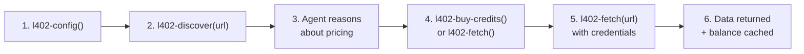

# 402-mcp

**Nostr:** [`npub1mgvlrnf5hm9yf0n5mf9nqmvarhvxkc6remu5ec3vf8r0txqkuk7su0e7q2`](https://njump.me/npub1mgvlrnf5hm9yf0n5mf9nqmvarhvxkc6remu5ec3vf8r0txqkuk7su0e7q2)

[](./LICENSE)
[](https://www.typescriptlang.org/)
[](https://nodejs.org/)
[](./docs/security.md)
[](https://primal.net/p/npub1mgvlrnf5hm9yf0n5mf9nqmvarhvxkc6remu5ec3vf8r0txqkuk7su0e7q2)
[](https://github.com/sponsors/TheCryptoDonkey)

L402 + x402 client MCP that gives AI agents economic agency. Discover, pay for, and consume any payment-gated API — no human registration, no API keys, no middlemen.

- **Discover** paid APIs on Nostr — no URLs needed upfront
- **Auto-pay** with Lightning (NWC), Cashu ecash, LNURLcash bearer notes, or human QR fallback
- **Credentials cached and encrypted** at rest (AES-256-GCM)
- **Works with any L402 server** — toll-booth, Aperture, or any future implementation

## Quick start

**1. Install**

```bash
npx 402-mcp
```

**2. Connect to Claude Code**

```bash
claude mcp add 402-mcp -- npx 402-mcp
```

**3. Try it**

Ask Claude: *"Search for paid joke APIs using l402-search"* — no wallet needed, just discovery.

Ready to make paid calls? See the [full quickstart guide](./docs/quickstart.md) to set up a wallet and watch your agent pay for its first API call.

Requires Node.js 22 or newer.

## How it works


```mermaid
graph LR
    A["1. l402-config()"] --> B["2. l402-discover(url)"]
    B --> C["3. Agent reasons<br/>about pricing"]
    C --> D["4. l402-buy-credits()<br/>or l402-fetch()"]
    D --> E["5. l402-fetch(url)<br/>with credentials"]
    E --> F["6. Data returned<br/>+ balance cached"]
```

**Example session:**

```
Agent: "I need routing data from routing.example.com"

1. l402-config()
   -> nwcConfigured: true, maxAutoPaySats: 1000

2. l402-discover("https://routing.example.com/api/route")
   -> 10 sats/request, toll-booth detected, tiers available

3. Agent reasons: "I need ~20 requests. The 500-sat tier
   gives 555 credits. Better value."

4. l402-buy-credits(url, amountSats=500)
   -> Paid 500 sats, received 555 credits

5. l402-fetch("https://routing.example.com/api/route?from=...&to=...")
   -> 200 OK, route data, 545 credits remaining
```

For detailed architecture and payment flow diagrams, see [docs/architecture.md](./docs/architecture.md).

## Configuration

| Variable | Default | Description |
|----------|---------|-------------|
| `NWC_URI_FILE` | - | Path to a private `0600` file containing the NWC bearer URI |
| `CASHU_TOKENS` | - | Path to Cashu token store file |
| `LNURLCASH_NOTES` | - | Path to LNURLcash bearer note store file (LUD-25) |
| `MAX_AUTO_PAY_SATS` | 1000 | Most a single automatic payment may cost. Anything dearer is not paid; the challenge goes back to the agent |
| `MAX_SPEND_PER_MINUTE_SATS` | 10000 | Automatic spend allowed in any rolling 60 seconds. `0` blocks all auto-pay |
| `MAX_SPEND_PER_DAY_SATS` | 5000 | Automatic spend allowed in any rolling 24 hours, kept in `~/.402-mcp/spend-ledger.json` so a restart does not reset it. `0` blocks all auto-pay |
| `CREDENTIAL_STORE` | `~/.402-mcp/credentials.json` | Persistent macaroon/credential storage |
| `TRANSPORT` | `stdio` | Transport mode: `stdio` or `http` |
| `PORT` | 3402 | HTTP server port (when `TRANSPORT=http`) |
| `TRANSPORT_PREFERENCE` | `onion,hns,https,http` | Preferred transport order for multi-URL services (comma-separated) |
| `TOR_PROXY` | - | SOCKS5 proxy for `.onion` addresses only (e.g. `socks5h://127.0.0.1:9050`) |
| `SOCKS_PROXY` | - | SOCKS5 proxy for every paid-API request (e.g. Tor at `socks5h://127.0.0.1:9050`). Set this or `TOR_PROXY`, not both |
| `HNS_GATEWAY_URL` | - | HTTP gateway for Handshake (`.hns`) domains (e.g. `https://hns.to`) |

### Transport selection and fallback

When a kind 31402 event advertises multiple URLs (one per transport), 402-mcp selects the best one based on your configuration:

1. **Preference first**: URLs are tried in `TRANSPORT_PREFERENCE` order, `onion,hns,https,http` by default. Use `onion`, `hns`, `https` and `http` as the values.
2. **Capability filter**: `.onion` URLs are skipped unless `TOR_PROXY` or `SOCKS_PROXY` is set, so without a proxy the default order starts at HNS and clearnet.
3. **Availability fallback**: if a transport is unreachable (connection refused, timeout), the next URL is tried.

Services can announce multiple endpoints for the **same service** (same pricing, same macaroon key) on different transports. This is purely for censorship resistance; you do not need to re-authenticate when switching transports. To reach Tor or HNS endpoints you must configure the corresponding proxy/gateway env vars above.

### Tor and SOCKS5

- **`TOR_PROXY`** sends `.onion` requests through the proxy. Everything else connects directly.
- **`SOCKS_PROXY`** sends every request to a paid API through the proxy, including redirects. Host names are resolved by the proxy, never by this machine, so a Tor proxy hides both your IP and the names you look up. The SSRF guard still refuses private IP literals and local names such as `localhost`; it cannot see what a name resolves to on the far side, which Tor exits refuse for private ranges anyway.

Neither setting covers wallet or discovery traffic: NWC relays, Cashu and LNURLcash mints, and the Nostr relays `l402-search` queries still connect directly. Handshake lookups are switched off under `SOCKS_PROXY`, because the DNS-over-HTTPS query would go around the proxy.

SOCKS5 support comes from undici's `Socks5ProxyAgent`, which Node marks experimental; expect one `ExperimentalWarning` on stderr when a proxy is configured.

## Tools

### Core L402 (any server)

| Tool | Description |
|------|-------------|
| `l402-config` | Introspect payment capabilities (wallets, limits, credential count) |
| `l402-discover` | Probe an endpoint to discover pricing without paying |
| `l402-fetch` | HTTP request with L402 support; auto-pays if within budget |
| `l402-pay` | Pay a specific invoice (NWC, Cashu, or human-in-the-loop) |
| `l402-credentials` | List stored credentials and cached balances |
| `l402-balance` | Check cached credit balance for a server |
| `l402-search` | Discover L402 services on Nostr relays (kind 31402 announcements) |
| `l402-store-token` | Store an L402 token obtained from a payment page |

### toll-booth extensions

| Tool | Description |
|------|-------------|
| `l402-buy-credits` | Browse and purchase volume discount tiers |
| `l402-redeem-cashu` | Redeem Cashu tokens directly (avoids Lightning round-trip) |

## Payment methods

Four payer methods, tried in priority order:

1. **NWC** (Nostr Wallet Connect) — fully autonomous; pays from your connected wallet
2. **Cashu** — fully autonomous; melts ecash tokens to pay invoices
3. **LNURLcash**: fully autonomous; melts LUD-25 bearer notes to pay invoices
4. **Human-in-the-loop** — presents QR code, polls for settlement

The agent can override the method per-call, or you can configure only the methods you want.

`l402-fetch` handles five HTTP 402 challenge variants transparently:

| Protocol | Challenge header | Payment |
|----------|-----------------|---------|
| **L402** | `WWW-Authenticate: L402` | Lightning invoice via wallet stack |
| **IETF Payment** (`draft-ryan-httpauth-payment-01`) | `WWW-Authenticate: Payment` | Lightning invoice via wallet stack |
| **LNURLcash** (LUD-25) | `X-LNURLcash: lnurlcashreq1…` | Bearer note handed over directly (requires a note store) |
| **xCashu** (NUT-18) | `X-Cashu: creqA…` | Ecash token sent directly (requires Cashu wallet) |
| **x402** | `X-Payment-Required: x402` | On-chain EVM transfer; surfaced to human with EIP-681 deeplink |

An LNURLcash challenge is tried first. A bearer note is already money in hand,
so paying one costs no Lightning hop and no swap at the mint: the note goes
straight into the retry header and the server settles it. When the price does
not match a note exactly, one is split at the mint and the change stays in the
store. If no note covers it, the other rails are tried as usual.

## Spending limits

402-mcp checks every automatic payment against these, and the agent can read them with `l402-config`:

- `MAX_AUTO_PAY_SATS` caps each payment. A dearer challenge is returned to the agent unpaid.
- `maxCostSats` on `l402-fetch` lowers that cap for one call, so the price shown by `l402-fetch-preview` is binding. It can never raise it.
- `MAX_SPEND_PER_MINUTE_SATS` and `MAX_SPEND_PER_DAY_SATS` cap total automatic spend over rolling windows. The daily window is persisted, so restarting the server does not reset it. `0` in either blocks auto-pay entirely.
- A payment whose outcome is unknown pauses auto-pay to that service until `l402-reconcile` resolves it, so the same thing is not bought twice.

**The real hard limit is the budget on your NWC connection.** Everything above is enforced in software by this process, on the machine it runs on. Most NWC wallets let you set a spending budget when you create the connection; set one, because that is the limit a bug or a misbehaving agent cannot raise. For Cashu and LNURLcash, the hard limit is what you put in the token or note store.

## Privacy

402-mcp stores credentials locally on your machine only (`~/.402-mcp/credentials.json`, encrypted at rest). No data is sent to any third party. No accounts, no tracking, no analytics. Payments use Lightning or Cashu — pseudonymous by design.

## Ecosystem

Browse live L402 services at [402.pub](https://402.pub) — the decentralised marketplace for payment-gated APIs.

| Project | Role |
|---------|------|
| [toll-booth](https://github.com/forgesworn/toll-booth) | Payment-backend agnostic HTTP 402 middleware |
| [satgate](https://github.com/forgesworn/satgate) | Pay-per-token AI inference proxy (built on toll-booth) |
| **[402-mcp](https://github.com/forgesworn/402-mcp)** | **MCP client — AI agents discover, pay, and consume L402 + x402 APIs** |
| [402-announce](https://github.com/forgesworn/402-announce) | Publish L402 services on Nostr for decentralised discovery |

402-mcp is the **wallet-provider agnostic** alternative to Lightning Labs' [lightning-agent-tools](https://github.com/lightninglabs/lightning-agent-tools) and Coinbase's x402 — no Lightning node required, multiple wallets, encrypted credentials.

<details>
<summary>Full comparison</summary>

| | 402-mcp | Lightning Labs agent tools |
|---|---|---|
| **Payer methods** | NWC + Cashu + human fallback | Lightning only |
| **Node required?** | No — connects to any NWC wallet | Yes — runs LND |
| **Server compatibility** | Any L402 server | Aperture-focused |
| **Spend safety** | Per-payment cap, per-call max cost, rolling 60s and persisted 24h windows | Per-call max-cost |
| **Credential storage** | Encrypted at rest (AES-256-GCM) | File permissions |
| **Privacy** | No PII, SSRF protection, error sanitisation | Standard |

Use Lightning Labs' tools if you want agents that **run their own Lightning node**. Use 402-mcp if you want agents that **pay from any wallet without infrastructure**.

</details>

See [CONTRIBUTING.md](./CONTRIBUTING.md) for development setup and guidelines.

---

Built by [@forgesworn](https://github.com/forgesworn).

- Lightning tips: `profusemeat89@walletofsatoshi.com`
- Nostr: `npub1mgvlrnf5hm9yf0n5mf9nqmvarhvxkc6remu5ec3vf8r0txqkuk7su0e7q2`

---

## Part of the ForgeSworn Toolkit

[ForgeSworn](https://forgesworn.dev) builds open-source cryptographic identity, payments, and coordination tools for Nostr.

| Library | What it does |
|---------|-------------|
| [nsec-tree](https://github.com/forgesworn/nsec-tree) | Deterministic sub-identity derivation |
| [ring-sig](https://github.com/forgesworn/ring-sig) | SAG/LSAG ring signatures on secp256k1 |
| [range-proof](https://github.com/forgesworn/range-proof) | Pedersen commitment range proofs |
| [canary-kit](https://github.com/forgesworn/canary-kit) | Coercion-resistant spoken verification |
| [spoken-token](https://github.com/forgesworn/spoken-token) | Human-speakable verification tokens |
| [toll-booth](https://github.com/forgesworn/toll-booth) | L402 payment middleware |
| [geohash-kit](https://github.com/forgesworn/geohash-kit) | Geohash toolkit with polygon coverage |
| [nostr-attestations](https://github.com/forgesworn/nostr-attestations) | NIP-VA verifiable attestations |
| [dominion](https://github.com/forgesworn/dominion) | Epoch-based encrypted access control |
| [nostr-veil](https://github.com/forgesworn/nostr-veil) | Privacy-preserving Web of Trust |

## Licence

[MIT](LICENSE)
