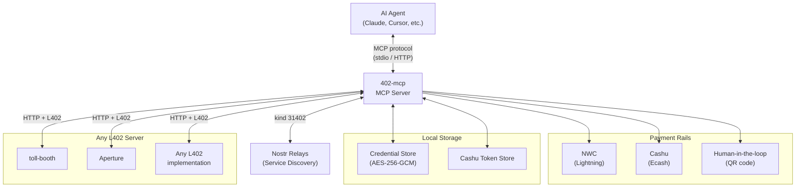
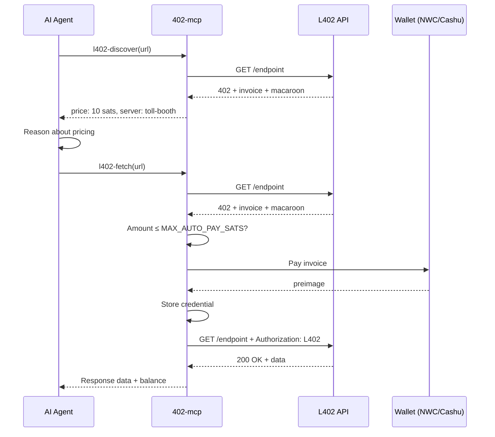
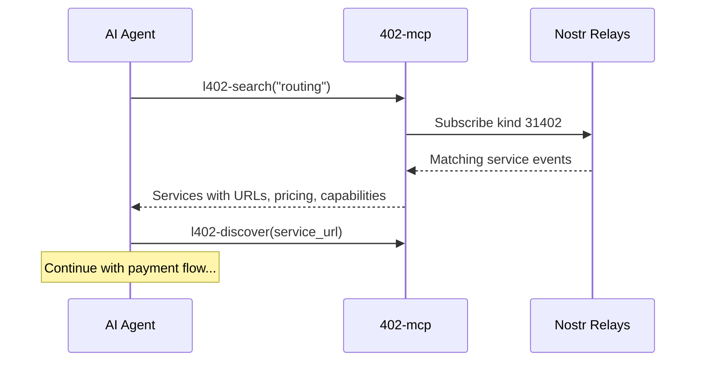
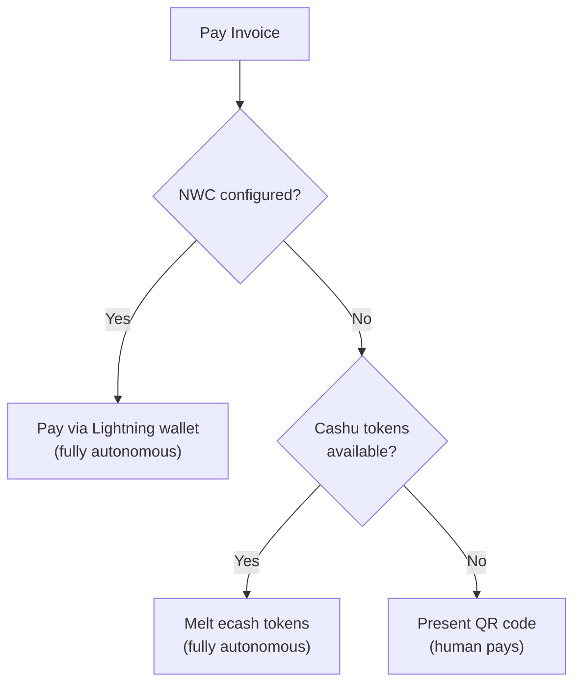

# Architecture

Technical reference diagrams for 402-mcp. For a quick overview, see the [README](../README.md).

## System architecture

How 402-mcp connects AI agents to paid APIs via multiple payment rails.

## Payment flow

The full lifecycle: discover pricing, pay the invoice, store the credential, fetch the data.

## Service discovery

Agents discover paid APIs without knowing URLs upfront. `l402-search` queries Nostr relays for kind 31402 service announcements — the decentralised registry for L402 services.

## Payment method selection

402-mcp tries payment methods in priority order, falling back automatically.

